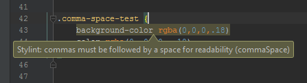
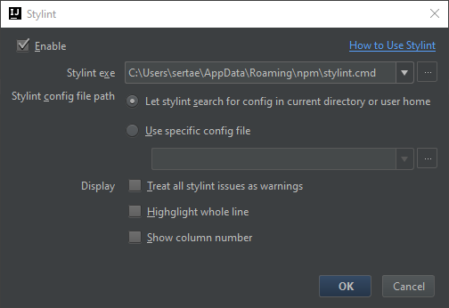
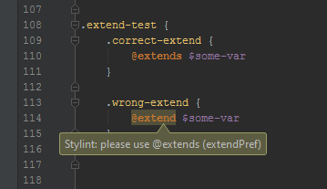

# Stylint Plugin

This plugin provides integration for [Stylint](https://github.com/rossPatton/stylint) inside Intellij IDEA editors family by showing errors and warnings inside the editor.



## How to use
### Requirements

- Intellij branch 145: `IntelliJ IDEA 2016.1, WebStorm 2016.1, PhpStorm 2016.1`
- `stylint` >= 1.5.0
- `stylint-json-reporter` >= 0.3.1

Compiled with Java 1.8

### Install required node modules

Plugin require [stylint](https://github.com/rossPatton/stylint) and [stylint-json-reporter](https://github.com/sertae/stylint-json-reporter) to do the hard work.

```
npm install -g stylint stylint-json-reporter
```

### Install plugin

#### Jetbrains Plugin Repository
Find [stylint-plugin](https://plugins.jetbrains.com/plugin/9162) in your IDE plugin repository.

#### Manual
Download  JAR file from [releases](https://github.com/sertae/stylint-plugin/releases) section. Then follow JetBrains [Installing Plugin from Disk](https://www.jetbrains.com/help/webstorm/2016.1/installing-plugin-from-disk.html?origin=old_help) instructions.

### Configure plugin settings page
To get started, you need to set the Stylint plugin settings:

* Go to preferences, Stylint plugin page and check `Enable` plugin.
* Select the path to the Stylint executable.
* Set the `.stylintrc` file, or Stylint will use the default settings.
* By default, Stylint plugin annotate the editor with warning or error based on the Stylint configuration, you can check the 'Treat all stylint issues as warnings' checkbox to display all issues from stylint as warnings.
* Stylint plugin will also try to highlight error in the right place. If you prefer more verbose display you can check the 'Highlight whole line' setting. Otherwise Stylint plugin will highlight whole lines only for those errors where more precise display was not possible.
* Show column number setting is mostly for debugging, but maybe someone will find it useful.

Configuration window:



Inspection example:



## Changelog

#### [0.2.0] - 2016-10-07

Update description. Prepare plugin for public use.

#### [0.1.0] - 2016-03-29

First public version of stylint-plugin

## Credit

Thanks @idok for two great plugins [scss-lint-plugin](https://github.com/idok/scss-lint-plugin) and [eslint-plugin](https://github.com/idok/eslint-plugin) on which stylint-plugin is build on.

## License

MIT &copy; 2016 Wojciech Czerniak<br>
MIT &copy; 2014 Idok